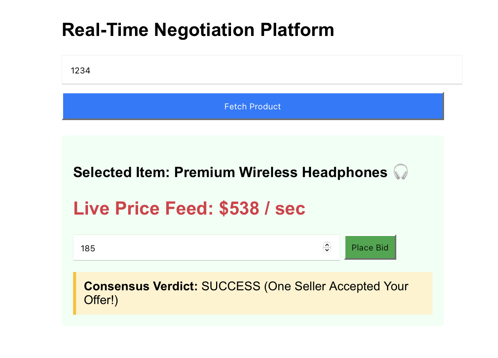

# Web Application that query product name, summit bid price, get offers from multiple workers

-  Frontend: react
   Backend: fastAPI, daemon worker processes, postgreSQL
   middleware: APIGateway, Kafka event broker

   - frontend UI fetch the product name via restful POST request, API gateway send the request based on
     path matching to the backend process which then query database and send response back to UI.
    
   -  Once the product is fetched, UI connect to  websocket and send request via /ws path,
      backend start update the product price every 1 second after get the request,
      and send via web socket to be refreshed on UI.
     
   -  User can summit a bid to the product, the submitted price is sent via the websocket, then API Gateway
      relay this bid price to backend server, which created Kafka topic producer and consumer when pod started,
      now add an Kafka event for the bid_topic queue with the bid price and product name.
      The two worker processes (running in two pods which also created a Kafka topic producer verdict_topic
      and consumer bid_topic) which subscribed to the topic then process the message and randomly choose to
      accept or decline the offer. The aggregated results then send back to the UI and display.

  - backend has the web socket open for simultaneous update price in an async loop and process bid/offer results.
   
  - worker process need to wait a short time about 2 mins to start in order for the Kafka broker fully started.
          

## Runbook:  
  1. first source minikube_start.sh , then ./run.sh
  2. during debug or update, can run the following script respectively:
     - run_appyaml.sh
     - update_frontend.sh
     - update_backend.sh
     - run_worker.sh


## UI 


### the kafka broker for local testing is deployed as a pod, to deployy as StatefulSet, following is 
    the notes from Google AI:

If your Kafka brokers are deployed as a StatefulSet with at least 3 replicas (e.g., replicas: 3), 
Kafka defaults to its standard production settings.

You can completely remove those three REPLICATION_FACTOR overrides from your YAML file.
Why 3 Replicas Fixes it 
  - Natively when you have 3 separate Kafka pods running, the default production values match 
    your physical infrastructure perfectly:
       KAFKA_OFFSETS_TOPIC_REPLICATION_FACTOR: Defaults to 3. 
    This means your group positions are safely duplicated across all 3 nodes.

    KAFKA_TRANSACTION_STATE_LOG_REPLICATION_FACTOR: 
    Defaults to 3.

    KAFKA_TRANSACTION_STATE_LOG_MIN_ISR: Defaults to 2 (In-Sync Replicas). 
     It requires at least 2 out of your 3 nodes to be completely synchronized 
       before accepting transactions.

 - What You Will Need to Add for a 3-Node Cluster
       While you get to delete the coordinator overrides, you will need to add 
    two new network environment variables so the 3 separate pods can talk to each other 
    and coordinate who is the "boss" (the leader). Inside your 3-replica StatefulSet template, 
    you must configure the Quorum Voters and Advertised Listeners to dynamically reference the 
    unique internal names of all three pods:

### Inside a 3-replica Kafka StatefulSet:
```
spec:
  replicas: 3 # <-- Multi-node cluster
  template:
    spec:
      containers:
      - name: kafka
        env:
        # 1. List all 3 pods as voters (pod-name.service-name)
        - name: KAFKA_CONTROLLER_QUORUM_VOTERS
          value: "1@kafka-broker-0.kafka-service:9093,2@kafka-broker-1.kafka-service:9093,3@kafka-broker-2.kafka-service:9093"
          
        # 2. Tell each pod to dynamically advertise its own specific pod name
        - name: KAFKA_ADVERTISED_LISTENERS
          value: "PLAINTEXT://kafka-broker-$(HOSTNAME).kafka-service:9092"

```

 So to transition the architecture -- can Write a production-ready 3-node Kafka StatefulSet manifest with persistent cloud hard drives.L
ook at how your FastAPI backend KAFKA_URL variable updates to load-balance across all 3 brokers automatically (e.g., kafka-broker-0:9092,
kafka-broker-1:9092,kafka-broker-2:9092). to scale up cluster configuration.
